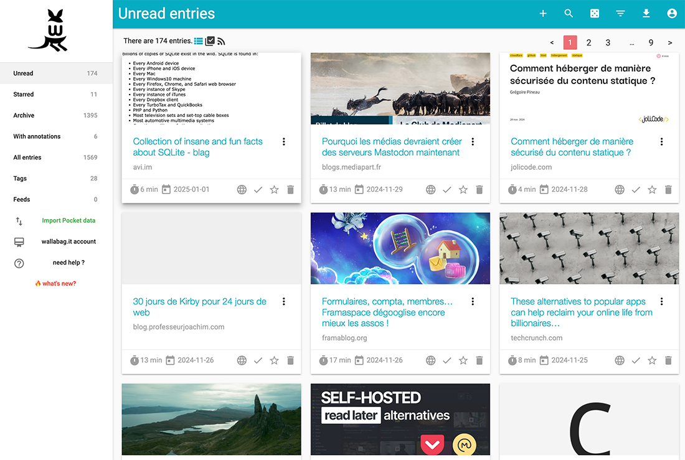
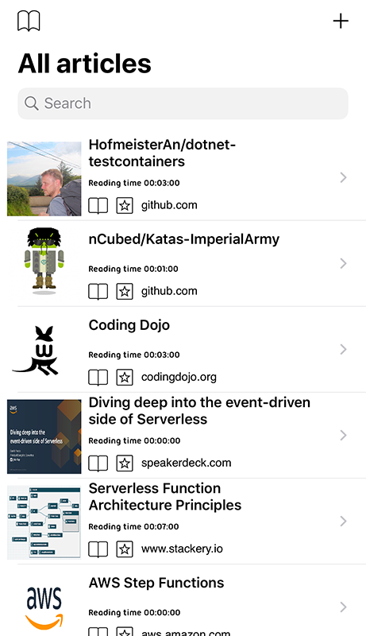
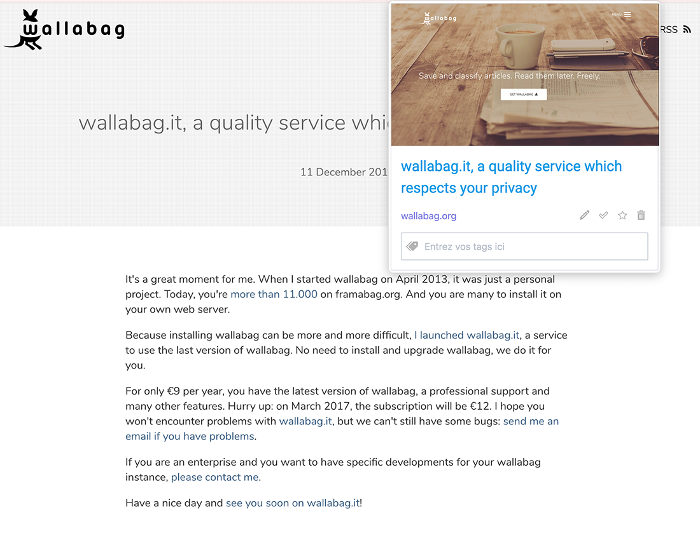

{}

{}

{}

You can find here smartphones applications, browsers addons or ereaders applications compatible with wallabag. Thanks to them, you can add new articles and read them easily. Just remember that before installing one of these applications, [you need to create firstly an account on wallabag.it](https://app.wallabag.it/).

{}

{}
Comfortable reading
{.h2}

wallabag extracts the article's content (and only its content!) and displays it in a comfortable view. Moreover, wallabag is responsive: you can read your articles on your smartphone or your tablet.

{.text-center}

{}

{}
Applications for your smartphone...
{.h2}

Android, iOS or Windows: An wallabag application is available for your device. It's so easy to read your saved articles on it. And it also works when you're offline.

{.text-center}

... and addons for your browser!
{.h2 .text-end}

Save new articles with one click thanks to our Chrome and Firefox addons.
{.text-end}

{.text-center}
{}

{}
And even more ...
{.h2}

Retrieve your articles quickly
{.h3}
wallabag provides filters and a search engine to retrieve your saved articles.
You can also use the tags feature to categorize them (eg: sports, work, web, etc.)

You found an interesting extract? Highlight it!
{.h3}
Thanks to our annotation system, you can hightlight extracts in your articles and write some notes.

Customize your account
{.h3}
Theme, language, reading speed, RSS: you can tune lots of parameters to make your wallabag something that suits you.

Keep your data forever
{.h3}

All your data belongs to you. You can download all your articles in many formats: PDF, ePUB, .mobi, JSON, CSV, txt or HTML.

{}
